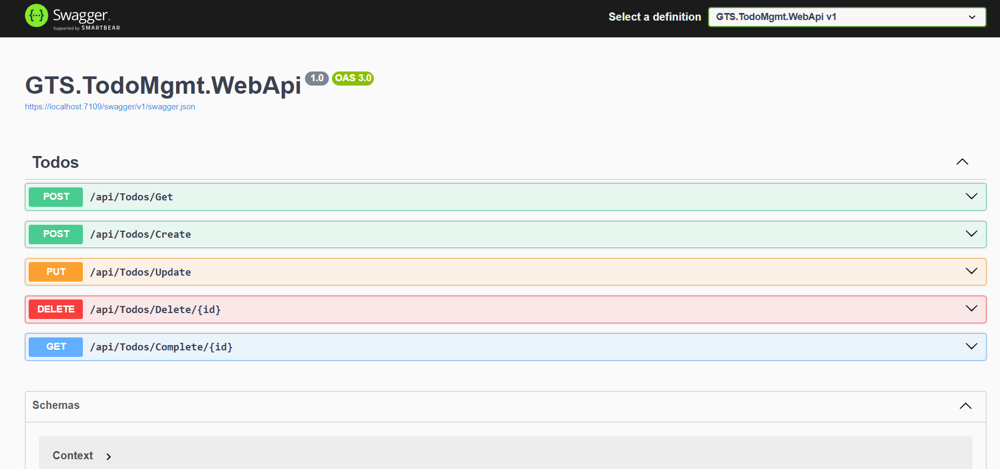
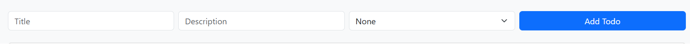
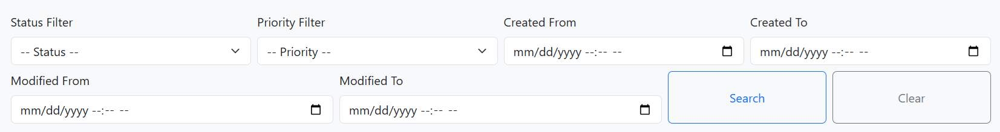
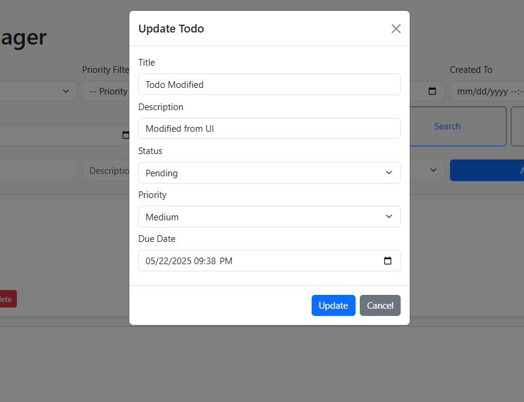
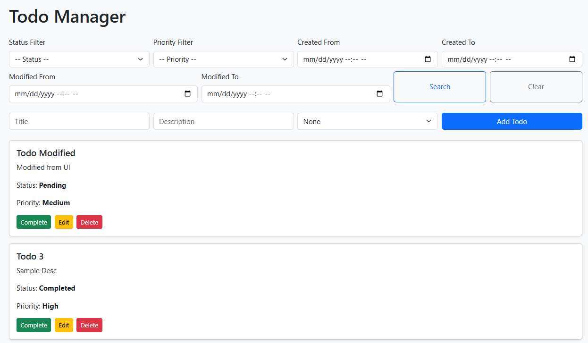

# Todo Management API

A simple Todo management application built using **ASP.NET Core 8** and **Entity Framework Core**. It allows users to manage their tasks with basic CRUD operations, status management, and filtering.

## 📌 Features

- CRUD operations for Todo items
- Filter todos by **status**, **priority**, **due date**, **modification date** and **creation date**
- Mark a todo as **complete**
- Basic Fluent validation
- Simple responsive frontend using **Bootstrap**
- Clean error handling and user feedback using Globa Exception Handling middleware.

## 🛠️ Tech Stack

- **Backend**: ASP.NET Core 8, Entity Framework Core
- **Frontend**: Bootstrap 5
- **Database**: MySQL (or configurable via EF Core)

## 📁 Project Structure

```
TodoManagement/
├── src/
│   ├── GTS.ToDoMgmt.Domain/            # Domain entities and logic
│   ├── GTS.ToDoMgmt.Application/       # Application services and DTOs
│   ├── GTS.ToDoMgmt.Infrastructure/    # EF Core DbContext and migrations
│   ├── GTS.TodoMgmt.WebApi/            # API controllers and endpoints
│   └── GTS.TodoMgmt.WebApi/wwwroot/    # Frontend with Bootstrap UI
```

## 🚀 Getting Started

### Prerequisites

- Visual Studio Installed
- [.NET 8 SDK](https://dotnet.microsoft.com/en-us/download)
- MySQL database

### Setup Instructions

1. **Clone the repository:**
   ```bash
   git clone https://github.com/raoufmohammed90/Todo-Management-API.git
   ```
   or using Visual Studio UI clone the repository.

2. **Build the solution so visual studio download and load projects dependencies.**

3. **Change the database connection string:**
    - Locate GTS.TodoMgmt.WebApi/wwwroot/appsettings.json
    - Under ConnectionStrings section you will find TodoMamagementDatabase key, change the host, username and password corresponding to your MySql instance.

4. **Apply database migrations using VS Package Manager Console:**
   ```bash
   Update-Database
   ```

5. **Run the application:**
   - Locate GTS.TodoMgmt.WebApi/wwwroot/todosHome.html
   - Right click then, View in browser.

6. **Access the app:**
   - The application runs and a browser window opens up.


## 🔗 API Endpoints (Sample)

| Method | Endpoint                    | Description              |
|--------|-----------------------------|--------------------------|
| POST    | `/api/todos`               | Get todos with optional filters.            |
| POST   | `/api/todos/create`                | Create new todo          |
| PUT    | `/api/todos/update`           | Update todo              |
| DELETE | `/api/todos/delete/{id}`           | Delete todo              |
| POST   | `/api/todos/complete/{id}`  | Mark as complete         |


## 📷 UI Screenshots

### Swagger Documentation


### Create Todo Form


### Todo Search Filters Form


### Update Todo Form


### Overall View


## 📄 License

This project is for interview assessment purposes and is not licensed for production use.
